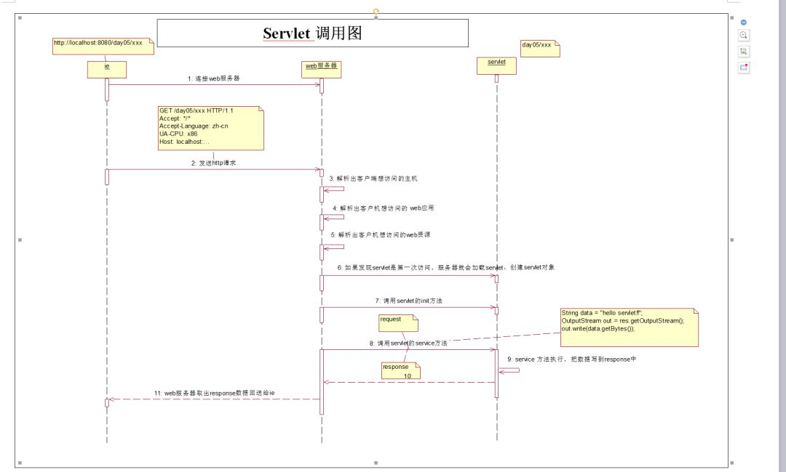
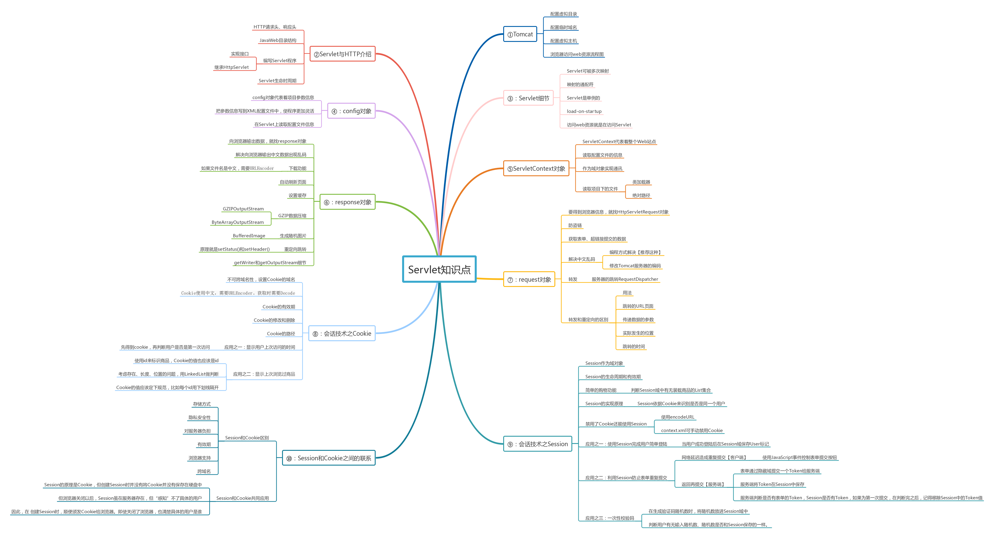

# servlet

## 1. 概念
* Servlet  Servlet 开发的，实现 Servlet 接口的 java 类。Servlet 带给我们最大的作用就是能够处理浏览器带来HTTP请求，并返回一个响应给浏览器，从而实现浏览器和服务器的交互。

### 1.1 Servlet 作用
实现浏览器和服务器的交互
* 接受请求
* 逻辑处理
* 返回响应

### 1.2 Servlet 接口

#### 1.2.1 Servlet 方法
* void init(ServletConfig config)
* void service(ServletRequest req, ServletResponse res)
* void destroy()
* ServletConfig getServletConfig()
* String getServletInfo()

#### 1.2.2 Servlet 生命周期
简单总结：只要访问Servlet，service()就会被调用。init()只有第一次访问Servlet的时候才会被调用。 destroy()只有在Tomcat关闭的时候才会被调用。
* 加载：当Tomcat第一次访问Servlet的时候，Tomcat会负责创建Servlet的实例
* 初始化：当Servlet被实例化后，Tomcat会调用init()方法初始化这个对象
* 处理服务：当浏览器访问Servlet的时候，Servlet 会调用service()方法处理请求
* 销毁：当Tomcat关闭时或者检测到Servlet要从Tomcat删除的时候会自动调用destroy()方法，让该实例释放掉所占的资源。一个Servlet如果长时间不被使用的话，也会被Tomcat自动销毁
* 卸载：当Servlet调用完destroy()方法后，等待垃圾回收。如果有需要再次使用这个Servlet，会重新调用init()方法进行初始化操作。

#### 1.2.3 Servlet 结构体系
* Servlet(I)
    * GenericServlet(A)
        * HttpServlet(A)

* 开发Servlet，最优方法是继承HttpServlet

#### 1.2.4 Servlet 调用图

#### 1.2.5 Servlet 一些细节
* ServletConfig对象
* ServletContext对象

* 一个已经注册的Servlet可以被多次映射
* Servlet映射的URL可以使用通配符
* Servlet是单例的
* 每次访问请求对象和响应对象都是新的
* 线程安全问题
* 在web访问任何资源都是在访问Servlet
* 重定向
* reference： https://mp.weixin.qq.com/s?__biz=MzI4Njg5MDA5NA==&mid=2247484755&idx=4&sn=01aa36130bc5b2d5ff5b9f67375d9ac5&chksm=ebd74452dca0cd447ed0845e12746e4c8828ec858ce24db0cd890c7e2fc95f8569f729e1fb36###rd

## 2. HttpServletRequest HttpServletResponse
* HttpServletResponse
    * 乱码问题 response.setContentType("text/html;charset=UTF-8");
    * getWriter()和getOutputStream()两个方法不能同时调用。如果同时调用就会出现异常
    * Servlet程序向ServletOutputStream或PrintWriter对象中写入的数据将被Servlet引擎从response里面获取，Servlet引擎将这些数据当作响应消息的正文，然后再与响应状态行和各响应头组合后输出到客户端。
    * Servlet的serice()方法结束后【也就是doPost()或者doGet()结束后】，Servlet引擎将检查getWriter或getOutputStream方法返回的输出流对象是否已经调用过close方法，如果没有，Servlet引擎将调用close方法关闭该输出流对象.
* HttpServletResponse
    * 防盗链
    * 中文乱码 request.setCharacterEncoding("UTF-8");
    * 转发

## 3. Cookie Session
* Cookie
    * 存储方式类似于Map
    * maxAge
    * domain
    * path
    * secure
* Session
    * session id 依赖于cookie
    * 若cookie禁用 可用url重写的方法使用session 即url后有sid=xxxxx 这样的参数

