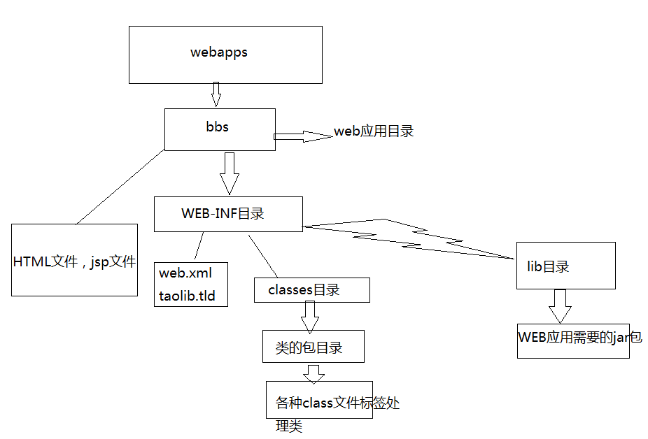

# servlet

## 1. 概念
* Servlet  Servlet 开发的，实现 Servlet 接口的 java 类。Servlet 是由服务器调用的，运行在服务器端。其实就是一个遵循
### 1.1 作用
实现浏览器和服务器的交互
* 接受请求
* 逻辑处理
* 返回响应
### 1.2 javaWeb 目录结构
* bbs目录代表一个web应用
* bbs目录下的html,jsp文件可以直接被浏览器访问
* WEB-INF目录下的资源是不能直接被浏览器访问的
* web.xml文件是web程序的主要配置文件
* 所有的classes文件都放在classes目录下
* jar文件放在lib目录下

当然也可以使用maven代替lib

### 1.3 Servlet 接口
#### 1.3.1 Servlet 方法
* void init(ServletConfig config)
* void service(ServletRequest req, ServletResponse res)
* void destroy()
* ServletConfig getServletConfig()
* String getServletInfo()
#### 1.3.1 Servlet 生命周期
简单总结：只要访问Servlet，service()就会被调用。init()只有第一次访问Servlet的时候才会被调用。 destroy()只有在Tomcat关闭的时候才会被调用。
* 加载：当Tomcat第一次访问Servlet的时候，Tomcat会负责创建Servlet的实例
* 初始化：当Servlet被实例化后，Tomcat会调用init()方法初始化这个对象
* 处理服务：当浏览器访问Servlet的时候，Servlet 会调用service()方法处理请求
* 销毁：当Tomcat关闭时或者检测到Servlet要从Tomcat删除的时候会自动调用destroy()方法，让该实例释放掉所占的资源。一个Servlet如果长时间不被使用的话，也会被Tomcat自动销毁
* 卸载：当Servlet调用完destroy()方法后，等待垃圾回收。如果有需要再次使用这个Servlet，会重新调用init()方法进行初始化操作。

