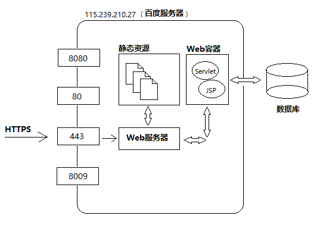
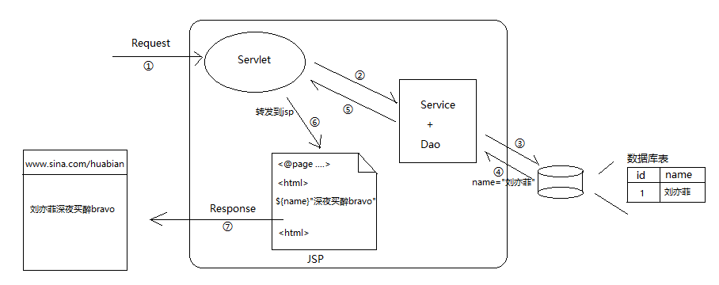
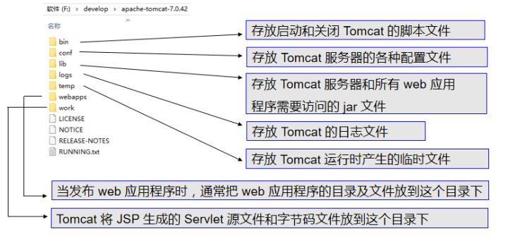
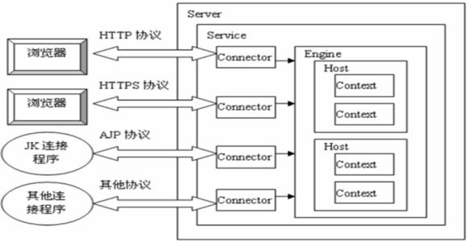
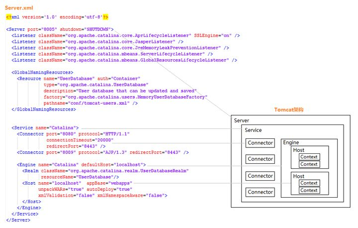
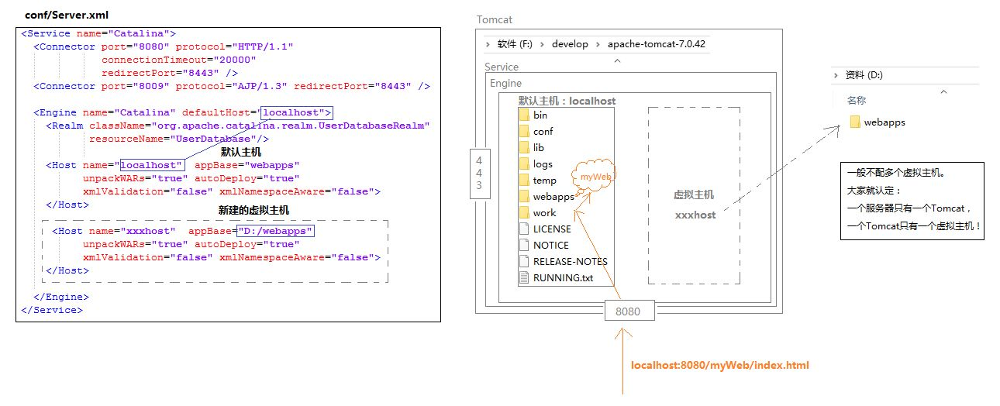
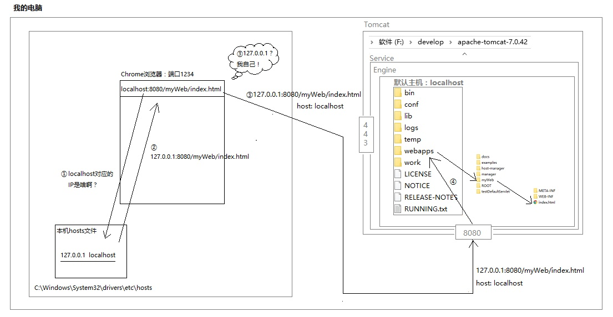

# Tomcat

## 1. 概念
### 1.1 java 分类
* javaSE(Java Standard Edition)
* javaEE(Java Platform Micro Edition)
* javaME(Java Platform Enterprise Edition)
### 1.2 javaEE 13 规范(specifications)
JDBC，JNDI，EJB，RMI，JSP，Servlets，XML，JMS，Java IDL，JTS，JTA，JavaMail，JAF
### 1.3 Tomcat
* The Apache Tomcat® software is an open source implementation of the Java Servlet, JavaServer Pages, Java Expression Language and Java WebSocket technologies.
* Tomcat 实现了 Servlet, JSP, EL  and WebSocket 4 种规范， 又叫轻量级服务器或Servlet/JSP容器
* JBoss、WebLogic 等实现了全部规范
* Tomcat依赖java
* 主要文件 Server.xml 和 web.xml

* Tomcat 服务器 = Web服务器 + Servlet/JSP容器（Web容器）
    1. Web服务器: 接受 + 响应
    2. Web容器: 动态资源Servlet/JSP

### 1.4 其他
* protocol：数据传输的规则
* IP：电子设备（计算机）在网络中的唯一标识，一个IP对应一台实体电脑
* port：应用程序在计算机中的唯一标识，一个端口只能被唯一程序占用

## 2. Tomcat 架构
### 2.1 Tomcat 目录

### 2.2 Tomcat 结构

结合Tomcat的一个配置文件(Server.xml)来看
* Server.xml文件中的配置结构和Tomcat的架构是一一对应的
* Server: 根目录，代表服务器
* Service: Server 下面有且仅有1个 Service 代表服务
* Connector: Service 下面有两个 Connector, 代表连接（需要的话可以再加）其实这个Connector就是我们在上面讨论百度服务器时画过的端口。大家可以看到Tomcat默认配置了两个端口，一个是HTTP/1.1协议的，一个是AJP/1.3协议（我也不知道是啥）。前者专门处理HTTP请求。当我们在浏览器输入"http://localhost:8080/demo/index.html"时，浏览器是以HTTP协议发送的，当这个请求到了服务器后，会被识别为HTTP类型，于是服务器就找来专门处理HTTP的Connector，它的默认端口正是上门Server.xml配置的8080。
* Engine: 与 Connector 平级的还有个 Engine（Tomcat引擎），也就是说 Service 有两个孩子，小儿子是 Connector ，大儿子是 Engine 。Connector 的作用说穿了就是监听端口，如果用户访问地址是“localhost:8080/xx/xx”，那就由监听8080端口的 Connector 负责，如果是"https://www.baidu.com"，那么就是443端口处理。其实 Connector 也不处理实际业务，它只是个孩子。但它会负责把客人（请求）带到哥哥 Engine 那，然后 Engine 会处理。
* Host: Engine 下面有 Host， 代表虚拟主机
* Context: webapp

***
reference: 