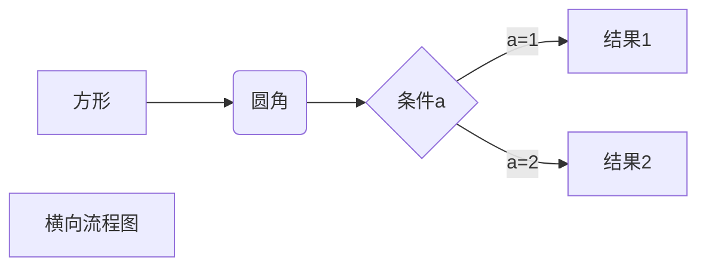
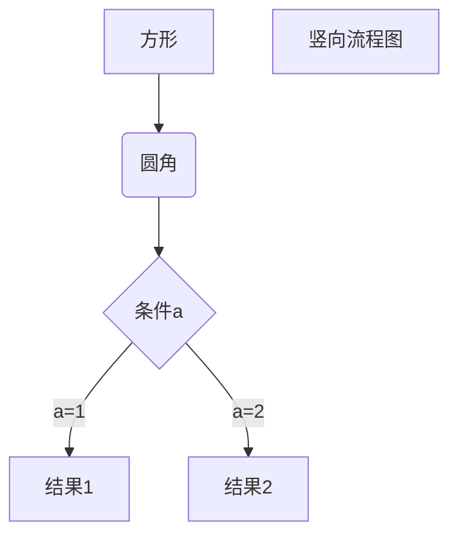
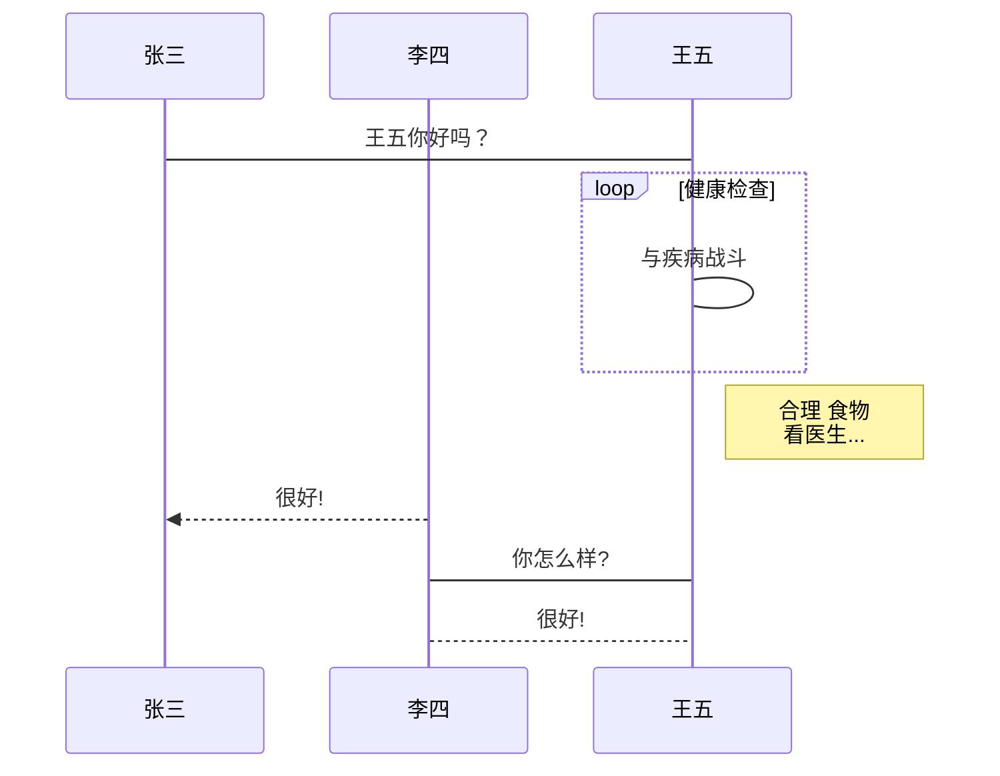
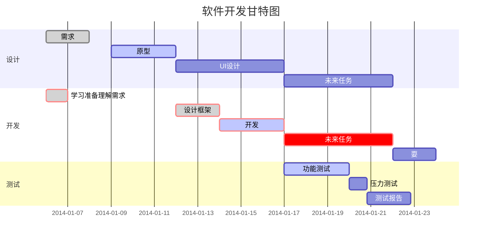

# title1
## title2
### title3
#### title4
##### title5
###### title6

***
***
***
---
---
---
___
___
___

*italy*

_italy_

**bond**

__bond__

***italy and bond***

___italy and bond___

~~BAIDU.COM~~

~~asndfkl~~

<u>带下划线文本</u>
***
***
***

* first
* second
* third

+ first
+ second
+ third

- first
- second
- third

1. first
2. second
3. third


1. first
    1. grandpa
        1. father
            1. son
            2. son
        2. father
    2. grandpa
2. second
3. third


+ first
    + grandpa
        + father
            + son
            + son
        + father
    + grandpa
+ second
+ third

***
***
***

> who are you  
> who am i  
> who are you  
who am i  
> > > who is she  
> 1. grandpa
>   + father
> 1. grandma

+ grandpa
    > who are you  
    who am i  
    who is she
+ grandma

***
***
***

    use tab or 4 space

```java
    class Test{
    public static void main(String[] args){
      string s = " use ``` ";
    }
    }
```

***
***
***

this is a link [runoob](https://www.runoob.com)

<https://www.runoob.com>


|  表头   | 表头  |
|  ----  | ----  |
| 单元格  | 单元格 |
| 单元格  | 单元格 |

| 左对齐 | 右对齐 | 居中对齐 |
| :-----| ----: | :----: |
| 单元格 | 单元格 | 单元格 |
| 单元格 | 单元格 | 单元格 |


***
***
***
reference: https://www.jianshu.com/p/191d1e21f7ed/
# 以下不需学习

目前支持的 HTML 元素有：
    
    <kbd> <b> <i> <em> <sup> <sub> <br>
    
Markdown 支持以下这些符号前面加上反斜杠来帮助插入普通的符号：

    \   反斜线
    `   反引号
    *   星号
    _   下划线
    {}  花括号
    []  方括号
    ()  小括号
    #   井字号
    +   加号
    -   减号
    .   英文句点
    !   感叹号
    
1、横向流程图源码格式：


2、竖向流程图源码格式：


3、标准流程图源码格式：

```flow
st=>start: 开始框
op=>operation: 处理框
cond=>condition: 判断框(是或否?)
sub1=>subroutine: 子流程
io=>inputoutput: 输入输出框
e=>end: 结束框
st->op->cond
cond(yes)->io->e
cond(no)->sub1(right)->op
```
4、标准流程图源码格式（横向）：

```flow
st=>start: 开始框
op=>operation: 处理框
cond=>condition: 判断框(是或否?)
sub1=>subroutine: 子流程
io=>inputoutput: 输入输出框
e=>end: 结束框
st(right)->op(right)->cond
cond(yes)->io(bottom)->e
cond(no)->sub1(right)->op
```
5、UML时序图源码样例：

```sequence
对象A->对象B: 对象B你好吗?（请求）
Note right of 对象B: 对象B的描述
Note left of 对象A: 对象A的描述(提示)
对象B-->对象A: 我很好(响应)
对象A->对象B: 你真的好吗？
```
6、UML时序图源码复杂样例：

```sequence
Title: 标题：复杂使用
对象A->对象B: 对象B你好吗?（请求）
Note right of 对象B: 对象B的描述
Note left of 对象A: 对象A的描述(提示)
对象B-->对象A: 我很好(响应)
对象B->小三: 你好吗
小三-->>对象A: 对象B找我了
对象A->对象B: 你真的好吗？
Note over 小三,对象B: 我们是朋友
participant C
Note right of C: 没人陪我玩
```
7、UML标准时序图样例：


8、甘特图样例：


